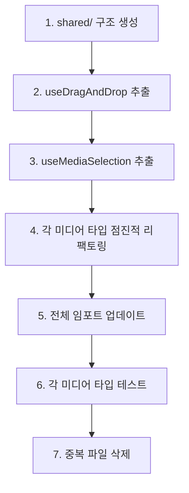

# Editor SubSidebar 리팩토링 분석 문서

## 📋 요약

editor-subSidebar 컴포넌트 시스템은 Feature-Sliced Design 원칙을 잘 따르는 구조이나, Video, Image, Music 서브 패널 전반에 걸쳐 **심각한 코드 및 로직 중복**이 발견되었습니다.

### 🔍 핵심 발견사항

| 항목 | 중복도 | 영향 범위 |
|-----|--------|----------|
| `useDragAndDrop` 훅 | **97%** | 3개 패널 (Video, Image, Music) |
| Selection 훅 패턴 | **95%** | Video, Image |
| Project Management 훅 | **90%** | Video, Image |
| 파일 업로드 UI 컴포넌트 | **95%** | 3개 컴포넌트 |

### 💡 개선 기회

- **5-6개의 공유 훅 추출** 가능
- **코드베이스 약 40% 감소** 예상
- **기술 부채 대폭 감소**
- **신규 미디어 타입 추가 용이**

---

## 🏗️ 현재 아키텍처 구조

### 전체 구조

```
editor-subSidebar/
├── ui/
│   ├── EditorSubSideBar.tsx       (라우터 컴포넌트)
│   └── _component/
│       ├── VideoEditSubSide/      (비디오 업로드 & 관리)
│       ├── ImageEditSubSide/      (이미지 업로드 & 관리)
│       ├── MusicEditSubSide/      (오디오 업로드 & 관리)
│       ├── TextEditSubSide/       (텍스트 생성)
│       └── CaptionEditSubSide/    (자막 편집)
```

### 미디어 패널 공통 패턴

각 미디어 패널(Video/Image/Music)은 일관된 구조를 따릅니다:

| 레이어 | 설명 | 예시 |
|--------|------|------|
| **메인 훅** | 하위 훅 조합 | `useVideoEdit`, `useImageEdit`, `useAudioEdit` |
| **서브 훅** | 세부 기능 | `useFileUpload`, `useDragAndDrop`, `useXXXSelection` |
| **팩토리 함수** | 미디어 요소 생성 | `createVideoElement` |
| **UI 컴포넌트** | 화면 렌더링 | Upload Area + Preview Area |

---

## 🚨 문제점 분석

## 1️⃣ 코드 중복 문제

### 1.1 거의 동일한 `useDragAndDrop` 훅

#### 📍 위치
- `VideoEditSubSide/model/hooks/useDragAndDrop.ts`
- `ImageEditSubSide/model/hooks/useDragAndDrop.ts`
- `MusicEditSubSide/model/hooks/useDragAndDrop.ts`

#### 📊 중복도
**97% 동일** (3개 파일, 108줄)

#### 🔴 문제점

**Video/Music 버전 (거의 동일):**
```typescript
export function useDragAndDrop() {
  const [dragActive, setDragActive] = useState(false);

  const handleDrag = (e: React.DragEvent) => {
    e.preventDefault();
    e.stopPropagation();
    if (e.type === "dragenter" || e.type === "dragover") {
      setDragActive(true);
    } else if (e.type === "dragleave") {
      setDragActive(false);
    }
  };

  const handleDrop = (e: React.DragEvent, onFilesDropped: (files: FileList) => void) => {
    e.preventDefault();
    e.stopPropagation();
    setDragActive(false);
    if (e.dataTransfer.files && e.dataTransfer.files.length > 0) {
      onFilesDropped(e.dataTransfer.files);
    }
  };

  return { dragActive, handleDrag, handleDrop };
}
```

**Image 버전 (불필요한 헬퍼 함수 추가):**
```typescript
// ❌ 한 번만 사용되는 불필요한 함수들
const isDragEnterOrOver = (eventType: string) => {
  return eventType === "dragenter" || eventType === "dragover";
};

const isDragLeave = (eventType: string) => {
  return eventType === "dragleave";
};
```

#### 💭 분석
Image 버전은 가독성을 오히려 해치는 불필요한 헬퍼 함수를 추가했습니다. **이 훅은 공유 위치로 추출되어야 합니다.**

---

### 1.2 유사한 Selection 훅 패턴

#### 📍 위치
- `VideoEditSubSide/model/hooks/useVideoSelection.ts`
- `ImageEditSubSide/model/hooks/useImageSelection.ts`

#### 📊 중복도
**95% 동일**

#### 🔴 문제점

**Video Selection:**
```typescript
export function useVideoSelection() {
  const [selectedVideoId, setSelectedVideoId] = useState<string | null>(null);
  const { media } = useMediaStore();

  const selectVideo = (videoId: string) => {
    setSelectedVideoId(videoId);
  };

  const clearSelection = () => {
    setSelectedVideoId(null);
  };

  const isVideoSelected = (videoId: string) => {
    return selectedVideoId === videoId;
  };

  const selectedVideo = selectedVideoId
    ? media.mediaElement.find((element) => element.id === selectedVideoId)
    : null;

  return {
    selectedVideoId,
    selectedVideo,
    selectVideo,
    clearSelection,
    isVideoSelected,
  };
}
```

**Image Selection (유일한 차이점):**
```typescript
const selectedImage = selectedImageId
  ? media.mediaElement.find(
      (el) => el.id === selectedImageId && el.type === "image"  // 타입 체크 추가
    )
  : null;
```

#### 💭 분석
95% 동일한 로직입니다. 유일한 차이는 타입 체크(`el.type === "image"`)뿐입니다. **TypeScript 제네릭을 사용한 `useMediaSelection<T>` 훅으로 통합 가능합니다.**

---

### 1.3 유사한 Project Management 훅

#### 📍 위치
- `VideoEditSubSide/model/hooks/useVideoProjectManagement.ts`
- `ImageEditSubSide/model/hooks/useImageProjectManagement.ts`

#### 📊 중복도
**90% 동일**

#### 🔴 문제점

```typescript
export function useVideoProjectManagement() {
  const { media, addMediaElement, updateMediaElement, deleteMediaElement } = useMediaStore();

  const addVideoToTimeLine = (videoData: VideoData) => {
    const videoElement = createVideoElement(videoData);

    // 중복 URL 체크
    const existingVideo = media.mediaElement.find((el) => el.url === videoData.url);
    if (existingVideo) {
      alert("Video already exists in the timeline");  // ❌ 하드코딩된 alert
      return;
    }

    addMediaElement(videoElement);
  };

  const updateVideoSettings = (videoId: string, updates: Partial<MediaElement>) => {
    updateMediaElement(videoId, updates);
  };

  const deleteVideo = (videoId: string) => {
    deleteMediaElement(videoId);
  };

  return { addVideoToTimeLine, updateVideoSettings, deleteVideo };
}

// Image 버전 - 동일한 로직에 Video → Image 치환만 수행
```

#### 💭 분석
두 훅 모두:
1. 추가 전 중복 URL 체크
2. 하드코딩된 `alert()` 사용 (❌ 나쁜 UX)
3. 스토어 메서드를 최소한의 로직으로 래핑
4. 동일한 구조의 API 반환

**제네릭 `useMediaProjectManagement` 훅으로 통합 가능합니다.**

---

### 1.4 중복된 파일 업로드 UI 컴포넌트

#### 📍 위치
- `VideoEditSubSide/ui/_component/VideoFileUploadArea.tsx`
- `ImageEditSubSide/ui/_component/ImageFileUploadArea.tsx`
- `MusicEditSubSide/ui/_component/AudioFileUploadArea.tsx`

#### 📊 중복도
**95% 동일** (3개 파일, 181줄)

#### 🔴 문제점

```typescript
export default function VideoFileUploadArea({ fileInputRef, actions, dragActive }) {
  return (
    <div
      className={`border-2 border-dashed rounded-lg p-6 text-center transition-colors w-full ${
        dragActive
          ? "border-blue-500 bg-blue-500/10"
          : "border-zinc-600 bg-zinc-800/50"
      }`}
      onDragEnter={actions.handleDrag}
      onDragLeave={actions.handleDrag}
      onDragOver={actions.handleDrag}
      onDrop={actions.handleDrop}
    >
      <input
        ref={fileInputRef}
        type="file"
        accept="video/*"  // ✅ 유일한 차이점 1
        multiple
        className="hidden"
        onChange={(e) => actions.handleFileSelect(e.target.files)}
      />

      <Upload className="mx-auto h-12 w-12 text-gray-400 mb-3" />
      <p className="text-gray-300 mb-2">Drag & drop your video file here</p>  {/* ✅ 차이점 2 */}
      <p className="text-gray-500 text-sm mb-4">or</p>
      <Button onClick={() => fileInputRef.current?.click()} variant="light" size="sm">
        Choose Video  {/* ✅ 차이점 3 */}
      </Button>
    </div>
  );
}
```

#### 📋 차이점

| 차이점 | Video | Image | Audio |
|--------|-------|-------|-------|
| `accept` 속성 | `video/*` | `image/*` | `audio/*` |
| 안내 텍스트 | "video file" | "image file" | "audio files" |
| 아이콘 | Upload | Upload | Music |
| 추가 상태 | - | - | `loading` |

#### 💭 분석
**설정 props를 받는 단일 제네릭 `<MediaFileUploadArea>` 컴포넌트로 통합 가능합니다.**

---

## 2️⃣ 불필요한 코드

### 2.1 사용되지 않는 Props

#### 📍 위치
- `VideoEditSubSide/ui/_component/VideoFileUploadArea.tsx:6-21`
- `ImageEditSubSide/ui/_component/ImageFileUploadArea.tsx:6-21`

#### 🔴 문제점

```typescript
interface VideoFileUploadAreaProps {
  fileInputRef: RefObject<HTMLInputElement | null>;
  actions: {
    handleFileSelect: (files: FileList | null) => void;    // ✅ 사용됨
    handleDrag: (e: React.DragEvent) => void;              // ✅ 사용됨
    handleDrop: (e: React.DragEvent) => void;              // ✅ 사용됨
    removeVideo: (index: number) => void;                  // ✅ 사용됨
    selectVideo: (videoId: string) => void;                // ❌ 미사용
    updateVideoSettings: (...) => void;                    // ❌ 미사용
    deleteVideo: (videoId: string) => void;                // ❌ 미사용
  };
  dragActive: boolean;
}
```

#### 💭 분석
컴포넌트는 실제로 `handleFileSelect`, `handleDrag`, `handleDrop`만 사용합니다. 선택/수정 메서드는 전혀 참조되지 않습니다. **컴포넌트 책임을 혼란스럽게 하고 불필요하게 결합도를 높입니다.**

---

### 2.2 불필요한 헬퍼 함수

#### 📍 위치
`ImageEditSubSide/model/hooks/useDragAndDrop.ts:6-12`

#### 🔴 문제점

```typescript
const isDragEnterOrOver = (eventType: string) => {
  return eventType === "dragenter" || eventType === "dragover";
};

const isDragLeave = (eventType: string) => {
  return eventType === "dragleave";
};
```

#### 💭 분석
이 함수들은:
1. 각각 한 번씩만 사용됨
2. 간단한 조건문을 추상화했지만 가독성을 개선하지 못함
3. 불필요한 추상화 오버헤드 추가
4. Video/Music 버전에는 없으며 오히려 더 명확함

---

## 3️⃣ 로직 중복 패턴

### 3.1 파일 처리 패턴

모든 메인 훅(`useVideoEdit`, `useImageEdit`, `useAudioEdit`)이 동일한 조합 패턴을 따릅니다:

```typescript
// 3번 반복되는 패턴
export function useXXXEdit() {
  const fileUpload = useFileUpload();
  const dragAndDrop = useDragAndDrop();
  const xxxSelection = useXXXSelection();
  const projectManagement = useXXXProjectManagement();

  const handleFileSelect = (files: FileList | null) => {
    fileUpload.handleFileSelect(files, projectManagement.addXXXToTimeLine);
  };

  const handleDrop = (e: React.DragEvent) => {
    dragAndDrop.handleDrop(e, (files) => {
      fileUpload.handleFileSelect(files, projectManagement.addXXXToTimeLine);
    });
  };

  return {
    fileInputRef: fileUpload.fileInputRef,
    state: { uploadedXXXs, selectedXXXId, dragActive, selectedXXX },
    actions: { handleFileSelect, handleDrag, handleDrop, removeXXX, ... }
  };
}
```

#### 💭 분석
**미디어별 프로세서를 설정으로 받는 제네릭 `useMediaEdit` 팩토리 함수로 추출 가능합니다.**

---

### 3.2 중복 URL 체크 로직

#### 📍 위치
- `VideoEditSubSide/model/hooks/useVideoProjectManagement.ts:18-22`
- `ImageEditSubSide/model/hooks/useImageProjectManagement.ts:11-15`
- `MusicEditSubSide/model/hooks/useAudioEdit.ts:43-48`

```typescript
// 3번 중복됨
const existingXXX = media.mediaElement.find((el) => el.url === xxxData.url);
if (existingXXX) {
  alert("XXX already exists in the timeline");  // ❌ 나쁜 UX
  return;
}
```

#### 💭 분석
**토스트 알림으로 개선된 공유 유틸리티 함수로 만들어야 합니다.**

---

### 3.3 ID 생성 불일치

| 위치 | 방식 | 코드 |
|------|------|------|
| **Video/Image** | Date + Random | `video-${Date.now()}-${Math.random()}` |
| **Audio** | uuid 라이브러리 | `uuidv4()` |
| **Text** | Web Crypto API | `crypto.randomUUID()` |
| **Audio Fallback** | Date + Random | `audio-${Date.now()}-${Math.random()}` |

#### 💭 분석
코드베이스 전반에 걸쳐 **4가지 다른 ID 생성 전략**이 사용됩니다.

**권장사항:** `crypto.randomUUID()` (네이티브, 의존성 없음, RFC 4122 준수)로 표준화

---

## 4️⃣ 아키텍처 문제

### 4.1 FSD 원칙 위반 (CaptionEditSubSide)

#### 🔴 문제점
`CaptionEditSubSide.tsx`에 **67줄의 비즈니스 로직이 인라인으로 포함**되어 있습니다:

```typescript
export default function CaptionEditSubSide() {
  const [editing, setEditing] = useState<...>(null);

  // ❌ model/hooks에 있어야 할 42줄의 비즈니스 로직
  const parseClockTime = useCallback((value: string): number | null => {
    // ... 17줄의 파싱 로직
  }, []);

  const hasOverlap = useCallback((elementId: string, ...) => {
    // ... 6줄의 겹침 감지 로직
  }, [media.textElement]);

  const commitClockEdit = useCallback((...) => {
    // ... 27줄의 검증 및 업데이트 로직
  }, [...]);

  // 등등...
}
```

#### 💭 분석
**FSD의 UI(`ui/`)와 비즈니스 로직(`model/`) 분리 원칙을 위반합니다.** 이 로직은 `model/hooks/useCaptionEdit.ts`로 추출되어야 합니다.

---

### 4.2 일관되지 않은 훅 반환 패턴

| 패턴 | 방식 | 예시 |
|------|------|------|
| **패턴 1** | 플랫 반환 (Video) | `{ fileInputRef, state: {...}, actions: {...} }` |
| **패턴 2** | 직접 반환 (Selection) | `{ selectedId, select, clearSelection, ... }` |
| **패턴 3** | 명시적 타입 (Audio) | `export function useAudioEdit(): { state: ..., actions: ... }` |

#### 💭 분석
일관되지 않은 패턴은 코드베이스 학습을 어렵게 만듭니다. **Audio 패턴(명시적 반환 타입)이 타입 안정성과 문서화 측면에서 가장 좋습니다.**

---

### 4.3 비동기/동기 혼용 팩토리 함수

**동기 (Video, Image):**
```typescript
export function createVideoElement(videoData: VideoData): MediaElement {
  return { id: generateVideoId(), ... };
}
```

**비동기 (Audio):**
```typescript
export function createAudioElement(audioUrl: string): Promise<AudioElement> {
  return new Promise((resolve, reject) => {
    const audio = new Audio(audioUrl);
    audio.addEventListener("loadedmetadata", () => {
      resolve(audioElement);
    });
  });
}
```

#### 💭 분석
Video는 업로드 시 메타데이터를 추출하지만, Audio는 팩토리에서 추출합니다. **업로드 단계에서 메타데이터를 추출하는 것으로 표준화해야 합니다.**

---

## 5️⃣ 가독성 문제

### 5.1 일관되지 않은 파일 명명

```
✅ VideoEditSubSide/ui/index.tsx
✅ ImageEditSubSide/ui/index.tsx
❌ MusicEditSubSide/ui/MusicEditSubSide.tsx
❌ TextEditSubSide/ui/TextEditSubSide.tsx
❌ CaptionEditSubSide/ui/CaptionEditSubSide.tsx
```

#### 💭 분석
**명시적 파일명 사용을 권장합니다** (에디터에서 찾기 쉽고, 스택 트레이스에서 명확함)

---

### 5.2 하드코딩된 Alert 메시지

#### 📍 위치 (7곳)
- `useVideoProjectManagement.ts:20`
- `useImageProjectManagement.ts:12`
- `useAudioEdit.ts:46`
- `useAudioFileProcessor.ts:48`

```typescript
alert("Video already exists in the timeline");
alert("Please select a valid audio file");
alert("Failed to read audio file");
```

#### ❌ 문제점

| 이유 | 설명 |
|------|------|
| 접근성 | 스크린 리더 미지원 |
| UX | UI 블로킹 |
| 테스트 | 테스트 어려움 |
| 일관성 | 모던 디자인 패턴과 불일치 |

#### 💭 분석
**토스트 알림 시스템이나 인라인 에러 상태로 교체해야 합니다.**

---

### 5.3 일관되지 않은 상수 정의

| 팩토리 | 방식 | 예시 |
|--------|------|------|
| **Video** | 파일 상단 상수 | `const DEFAULT_OPACITY = 1;` |
| **Image** | 파일 상단 상수 | `const DEFAULT_IMAGE_DURATION = 5;` |
| **Audio** | 인라인 값 | `volume: 1, speed: 1` |
| **Text** | 컴포넌트 인라인 | `positionX: 425, fontSize: 120` |

#### 💭 분석
**공유 상수 파일을 사용해야 합니다.**

---

## ✅ 리팩토링 권장사항

## 🔥 최우선 순위

### 1. 공유 `useDragAndDrop` 훅 추출

#### 📌 근거
97% 중복 코드 (3개 파일)

#### 📂 영향받는 파일
| 동작 | 파일 |
|------|------|
| ❌ 삭제 | `VideoEditSubSide/model/hooks/useDragAndDrop.ts` |
| ❌ 삭제 | `ImageEditSubSide/model/hooks/useDragAndDrop.ts` |
| ❌ 삭제 | `MusicEditSubSide/model/hooks/useDragAndDrop.ts` |
| ✅ 생성 | `editor-subSidebar/shared/hooks/useDragAndDrop.ts` |

#### 📊 예상 영향
**108줄 → 35줄** (67% 감소)

#### 💻 구현

```typescript
// ✅ 생성: editor-subSidebar/shared/hooks/useDragAndDrop.ts
import { useState } from "react";

export function useDragAndDrop() {
  const [dragActive, setDragActive] = useState(false);

  const handleDrag = (e: React.DragEvent) => {
    e.preventDefault();
    e.stopPropagation();
    if (e.type === "dragenter" || e.type === "dragover") {
      setDragActive(true);
    } else if (e.type === "dragleave") {
      setDragActive(false);
    }
  };

  const handleDrop = (
    e: React.DragEvent,
    onFilesDropped: (files: FileList) => void
  ) => {
    e.preventDefault();
    e.stopPropagation();
    setDragActive(false);

    if (e.dataTransfer.files?.length > 0) {
      onFilesDropped(e.dataTransfer.files);
    }
  };

  return {
    dragActive,
    handleDrag,
    handleDrop,
  };
}
```

---

### 2. 제네릭 `useMediaSelection` 훅 생성

#### 📌 근거
95% 중복 코드, TypeScript 제네릭으로 일반화 가능

#### 📂 영향받는 파일
| 동작 | 파일 |
|------|------|
| ❌ 삭제 | `VideoEditSubSide/model/hooks/useVideoSelection.ts` |
| ❌ 삭제 | `ImageEditSubSide/model/hooks/useImageSelection.ts` |
| ✅ 생성 | `editor-subSidebar/shared/hooks/useMediaSelection.ts` |

#### 📊 예상 영향
**64줄 → ~30줄** (53% 감소)

#### 💻 구현

```typescript
// ✅ 생성: editor-subSidebar/shared/hooks/useMediaSelection.ts
import { useState } from "react";
import { useMediaStore } from "@/entities/media/useMediaStore";
import { MediaElement } from "@/entities/media/types";

export function useMediaSelection<T extends MediaElement>(
  mediaType?: T["type"]
) {
  const [selectedId, setSelectedId] = useState<string | null>(null);
  const { media } = useMediaStore();

  const selectedItem = selectedId
    ? media.mediaElement.find(
        (el) => el.id === selectedId && (!mediaType || el.type === mediaType)
      )
    : null;

  const select = (id: string) => setSelectedId(id);
  const clearSelection = () => setSelectedId(null);
  const isSelected = (id: string) => selectedId === id;

  return {
    selectedId,
    selectedItem: selectedItem as T | null,
    select,
    clearSelection,
    isSelected,
  };
}
```

#### 🎯 사용법

```typescript
// useVideoEdit.ts에서
const videoSelection = useMediaSelection<VideoElement>("video");

// useImageEdit.ts에서
const imageSelection = useMediaSelection<ImageElement>("image");
```

---

### 3. 공유 ID 생성 유틸리티 추출

#### 📌 근거
4가지 다른 ID 생성 전략으로 인한 불일치 및 잠재적 충돌

#### 📂 영향받는 파일
| 동작 | 파일 |
|------|------|
| ✅ 생성 | `editor-subSidebar/shared/lib/generateMediaId.ts` |
| ♻️ 수정 | 모든 팩토리 함수 및 인라인 ID 생성 |

#### 📊 예상 영향
ID 생성 표준화, uuid 의존성 제거

#### 💻 구현

```typescript
// ✅ 생성: editor-subSidebar/shared/lib/generateMediaId.ts
/**
 * 미디어 요소를 위한 고유한 RFC 4122 준수 UUID를 생성합니다.
 * 네이티브 Web Crypto API를 사용합니다 (의존성 불필요).
 */
export function generateMediaId(prefix?: string): string {
  const uuid = crypto.randomUUID();
  return prefix ? `${prefix}-${uuid}` : uuid;
}
```

---

### 4. 제네릭 `MediaFileUploadArea` 컴포넌트 생성

#### 📌 근거
95% 중복 UI 코드 (3개 컴포넌트)

#### 📂 영향받는 파일
| 동작 | 파일 |
|------|------|
| ❌ 삭제 | `VideoEditSubSide/ui/_component/VideoFileUploadArea.tsx` |
| ❌ 삭제 | `ImageEditSubSide/ui/_component/ImageFileUploadArea.tsx` |
| ❌ 삭제 | `MusicEditSubSide/ui/_component/AudioFileUploadArea.tsx` |
| ✅ 생성 | `editor-subSidebar/shared/ui/MediaFileUploadArea.tsx` |

#### 📊 예상 영향
**181줄 → ~80줄** (56% 감소)

#### 💻 구현

```typescript
// ✅ 생성: editor-subSidebar/shared/ui/MediaFileUploadArea.tsx
import Button from "@/shared/ui/atoms/Button/ui/Button";
import { Upload, Music } from "lucide-react";
import { RefObject } from "react";

type MediaType = "video" | "image" | "audio";

interface MediaFileUploadAreaProps {
  mediaType: MediaType;
  fileInputRef: RefObject<HTMLInputElement | null>;
  onFileSelect: (files: FileList | null) => void;
  onDrag: (e: React.DragEvent) => void;
  onDrop: (e: React.DragEvent) => void;
  dragActive: boolean;
  loading?: boolean;
  disabled?: boolean;
}

const MEDIA_CONFIG = {
  video: {
    accept: "video/*",
    icon: Upload,
    text: "여기에 비디오 파일을 드래그 & 드롭하세요",
    button: "비디오 선택",
    description: "또는",
  },
  image: {
    accept: "image/*",
    icon: Upload,
    text: "여기에 이미지 파일을 드래그 & 드롭하세요",
    button: "이미지 선택",
    description: "또는",
  },
  audio: {
    accept: "audio/*",
    icon: Music,
    text: "여기에 오디오 파일을 드래그 & 드롭하세요",
    button: "오디오 파일 선택",
    description: "MP3, WAV, OGG, M4A 지원",
  },
} as const;

export default function MediaFileUploadArea({
  mediaType,
  fileInputRef,
  onFileSelect,
  onDrag,
  onDrop,
  dragActive,
  loading = false,
  disabled = false,
}: MediaFileUploadAreaProps) {
  const config = MEDIA_CONFIG[mediaType];
  const Icon = config.icon;

  return (
    <div
      className={`border-2 border-dashed rounded-lg p-6 text-center transition-colors w-full ${
        dragActive
          ? "border-blue-500 bg-blue-500/10"
          : "border-zinc-600 bg-zinc-800/50"
      }`}
      onDragEnter={onDrag}
      onDragLeave={onDrag}
      onDragOver={onDrag}
      onDrop={onDrop}
    >
      <input
        ref={fileInputRef}
        type="file"
        accept={config.accept}
        multiple
        className="hidden"
        onChange={(e) => onFileSelect(e.target.files)}
        disabled={disabled || loading}
      />

      <Icon className="mx-auto h-12 w-12 text-gray-400 mb-3" />
      <p className="text-gray-300 mb-2">{config.text}</p>
      <p className="text-gray-500 text-sm mb-4">{config.description}</p>
      <Button
        onClick={() => fileInputRef.current?.click()}
        variant="light"
        size="sm"
        disabled={disabled || loading}
      >
        {loading ? "처리 중..." : config.button}
      </Button>
    </div>
  );
}
```

---

### 5. Caption Edit 비즈니스 로직을 훅으로 추출

#### 📌 근거
FSD 관심사 분리 원칙 위반

#### 📂 영향받는 파일
| 동작 | 파일 |
|------|------|
| ♻️ 리팩토링 | `CaptionEditSubSide/ui/CaptionEditSubSide.tsx` |
| ✅ 생성 | `CaptionEditSubSide/model/hooks/useCaptionEdit.ts` |

#### 📊 예상 영향
UI에서 model 레이어로 **67줄의 비즈니스 로직** 이동

#### 💻 구현

```typescript
// ✅ 생성: CaptionEditSubSide/model/hooks/useCaptionEdit.ts
import { useState, useCallback, useMemo } from "react";
import { useMediaStore } from "@/entities/media/useMediaStore";

export function useCaptionEdit() {
  const { media, updateTextElement } = useMediaStore();
  const [editing, setEditing] = useState<{ id: string; field: "start" | "end" | "text" } | null>(null);

  const parseClockTime = useCallback((value: string): number | null => {
    const trimmed = value.trim();
    if (!/^\d{1,2}(:\d{2}){1,2}$/.test(trimmed)) return null;

    const parts = trimmed.split(":").map(Number);
    if (parts.some(isNaN)) return null;

    const [hours, minutes, seconds] = parts.length === 2
      ? [0, parts[0], parts[1]]
      : parts;

    if (seconds > 59 || minutes > 59) return null;
    return hours * 3600 + minutes * 60 + seconds;
  }, []);

  const hasOverlap = useCallback(
    (elementId: string, newStart: number, newEnd: number): boolean => {
      return media.textElement.some(
        (other) => other.id !== elementId && newStart < other.endTime && newEnd > other.startTime
      );
    },
    [media.textElement]
  );

  const beginEdit = useCallback((id: string, field: "start" | "end") => {
    setEditing({ id, field });
  }, []);

  const beginTextEdit = useCallback((id: string) => {
    setEditing({ id, field: "text" });
  }, []);

  const cancelEdit = useCallback(() => {
    setEditing(null);
  }, []);

  const commitClockEdit = useCallback(
    (elementId: string, field: "start" | "end", draftText: string) => {
      const element = media.textElement.find((el) => el.id === elementId);
      if (!element) return cancelEdit();

      const parsed = parseClockTime(draftText);
      if (parsed === null || parsed < 0) return cancelEdit();

      const newStart = field === "start" ? parsed : element.startTime;
      const newEnd = field === "end" ? parsed : element.endTime;

      if (newEnd <= newStart) return cancelEdit();
      if (hasOverlap(elementId, newStart, newEnd)) {
        alert("다른 자막과 겹침이 감지되었습니다");
        return cancelEdit();
      }

      updateTextElement(elementId, {
        startTime: newStart,
        endTime: newEnd,
        duration: newEnd - newStart,
      });
      cancelEdit();
    },
    [cancelEdit, hasOverlap, media.textElement, parseClockTime, updateTextElement]
  );

  const commitTextEdit = useCallback(
    (elementId: string, newText: string) => {
      const element = media.textElement.find((el) => el.id === elementId);
      if (!element) return cancelEdit();
      updateTextElement(elementId, { text: newText });
      cancelEdit();
    },
    [cancelEdit, media.textElement, updateTextElement]
  );

  const sortedTextElements = useMemo(() => {
    return [...media.textElement].sort((a, b) => a.startTime - b.startTime);
  }, [media.textElement]);

  return {
    state: {
      editing,
      sortedTextElements,
    },
    actions: {
      beginEdit,
      beginTextEdit,
      cancelEdit,
      commitClockEdit,
      commitTextEdit,
    },
  };
}
```

---

### 6. 팩토리 함수 패턴 표준화

#### 📌 근거
비동기/동기 패턴 불일치로 인한 혼란

#### 📂 영향받는 파일
| 동작 | 파일 | 변경사항 |
|------|------|----------|
| ♻️ 리팩토링 | `MusicEditSubSide/lib/audioElementFactory.ts` | 동기로 변경 |
| ♻️ 수정 | `MusicEditSubSide/model/hooks/useFileUpload.ts` | 업로드 시 메타데이터 추출 |

#### 📊 예상 영향
일관된 에러 핸들링, 단순화된 코드 흐름

---

## 🔶 중간 우선순위

### 7. 제네릭 `useMediaProjectManagement` 훅 생성

#### 📌 근거
90% 중복 코드

#### 📂 영향받는 파일
| 동작 | 파일 |
|------|------|
| ❌ 삭제 | `VideoEditSubSide/model/hooks/useVideoProjectManagement.ts` |
| ❌ 삭제 | `ImageEditSubSide/model/hooks/useImageProjectManagement.ts` |
| ✅ 생성 | `editor-subSidebar/shared/hooks/useMediaProjectManagement.ts` |

#### 💻 구현

```typescript
// ✅ 생성: editor-subSidebar/shared/hooks/useMediaProjectManagement.ts
import { useMediaStore } from "@/entities/media/useMediaStore";
import { MediaElement } from "@/entities/media/types";

export function useMediaProjectManagement<TInput, TElement extends MediaElement>(
  createElement: (input: TInput) => TElement,
  getUrl: (input: TInput) => string,
  mediaTypeName: string
) {
  const { media, addMediaElement, updateMediaElement, deleteMediaElement } = useMediaStore();

  const addToTimeLine = (input: TInput) => {
    const element = createElement(input);
    const url = getUrl(input);

    const existing = media.mediaElement.find((el) => el.url === url);
    if (existing) {
      // TODO: alert을 토스트 알림으로 교체
      alert(`${mediaTypeName}이(가) 이미 타임라인에 존재합니다`);
      return;
    }

    addMediaElement(element);
  };

  const updateSettings = (id: string, updates: Partial<TElement>) => {
    updateMediaElement(id, updates);
  };

  const deleteItem = (id: string) => {
    deleteMediaElement(id);
  };

  return {
    addToTimeLine,
    updateSettings,
    deleteItem,
  };
}
```

#### 🎯 사용법

```typescript
// useVideoEdit.ts에서
const projectManagement = useMediaProjectManagement(
  createVideoElement,
  (data) => data.url,
  "비디오"
);
```

---

### 8. `alert()`를 토스트 알림 시스템으로 교체

#### 📌 근거
더 나은 UX, 접근성, 테스트 가능성

#### 📂 영향받는 파일
- `alert()` 사용 중인 모든 파일 (7곳)
- `shared/ui/molecules/Toast/` (없는 경우 생성)

#### 📊 예상 영향
앱 전반의 일관된 UX 개선

---

### 9. 업로드 영역 컴포넌트에서 미사용 Props 제거

#### 📌 근거
컴포넌트 인터페이스 단순화, 결합도 감소

#### 📂 영향받는 파일
- `VideoEditSubSide/ui/_component/VideoFileUploadArea.tsx:6-21`
- `ImageEditSubSide/ui/_component/ImageFileUploadArea.tsx:6-21`

#### 💻 구현
actions 인터페이스에서 다음 제거:
- `selectVideo`
- `updateVideoSettings`
- `deleteVideo`
- `selectImage`
- `updateImageSettings`
- `deleteImage`

---

### 10. 공유 미디어 요소 상수 파일 생성

#### 📌 근거
기본값 중앙화, 수정 용이성

#### 📂 영향받는 파일
| 동작 | 파일 |
|------|------|
| ✅ 생성 | `editor-subSidebar/shared/constants/mediaDefaults.ts` |
| ♻️ 수정 | 모든 팩토리 함수 |

#### 💻 구현

```typescript
// ✅ 생성: editor-subSidebar/shared/constants/mediaDefaults.ts
export const MEDIA_DEFAULTS = {
  position: {
    top: "50%",
    left: "50%",
  },
  visual: {
    opacity: 1,
    rotation: "0deg",
    visibility: "visible" as const,
  },
  playback: {
    volume: 50,
    speed: 1,
  },
  image: {
    duration: 5,
    width: 400,
    height: 300,
  },
  text: {
    duration: 5,
    positionX: 425,
    positionY: 500,
    fontSize: 120,
    color: "#ffffff",
    backgroundColor: "bg-transparent",
    font: "Arial",
    width: 300,
    height: 300,
  },
} as const;
```

---

## 🔵 낮은 우선순위

### 11. 일관된 파일 명명 규칙

#### 📌 근거
에디터에서 탐색 용이, 스택 트레이스 명확성

#### 📂 변경사항
- `VideoEditSubSide/ui/index.tsx` → `VideoEditSubSide.tsx`
- `ImageEditSubSide/ui/index.tsx` → `ImageEditSubSide.tsx`

---

### 12. 훅 반환 타입 패턴 표준화

#### 📌 근거
일관성, IDE 지원 향상

#### 💻 구현
모든 메인 훅은 Audio처럼 명시적 반환 타입 선언

---

### 13. Preview/List 영역 컴포넌트 패턴 추출

#### 📌 근거
프리뷰 영역에 일부 중복 존재

#### 📝 참고
업로드 영역보다 컴포넌트 간 차이가 많아 우선순위 낮음

---

## 🏗️ 제안된 아키텍처 변경

## 옵션 1: 공유 훅 + 특수화된 컴포넌트 (✅ 권장)

### 📝 설명
재사용 가능한 모든 훅을 공유 위치로 추출하되, 컴포넌트별 UI는 분리 유지

### 🗂️ 구조

```
editor-subSidebar/
├── shared/                          ✅ 새 디렉토리
│   ├── hooks/
│   │   ├── useDragAndDrop.ts
│   │   ├── useMediaSelection.ts
│   │   ├── useMediaProjectManagement.ts
│   │   └── index.ts
│   ├── ui/
│   │   └── MediaFileUploadArea.tsx
│   ├── lib/
│   │   └── generateMediaId.ts
│   └── constants/
│       └── mediaDefaults.ts
├── ui/
│   ├── EditorSubSideBar.tsx
│   └── _component/
│       ├── VideoEditSubSide/
│       │   ├── model/
│       │   │   ├── hooks/
│       │   │   │   ├── useVideoEdit.ts    (공유 훅 사용)
│       │   │   │   └── useFileUpload.ts   (비디오 전용)
│       │   │   └── types.ts
│       │   ├── lib/
│       │   │   └── videoElementFactory.ts
│       │   └── ui/
│       │       ├── VideoEditSubSide.tsx
│       │       └── _component/
│       │           └── VideoPreviewArea.tsx
│       ├── ImageEditSubSide/          (유사 구조)
│       ├── MusicEditSubSide/          (유사 구조)
│       ├── TextEditSubSide/
│       └── CaptionEditSubSide/
```

### ✅ 장점

| 장점 | 설명 |
|------|------|
| 코드 감소 | 중복 훅 코드 67% 제거 |
| 명확한 분리 | 제네릭과 특수 로직 간 명확한 구분 |
| 확장성 | 새 미디어 타입 추가 용이 |
| FSD 준수 | Feature-Sliced Design 원칙 준수 |
| 호환성 | 내부 리팩토링으로 하위 호환성 유지 |

### ❌ 단점

- 새 `shared/` 디렉토리 구조 생성 필요
- 초기에는 탐색할 파일 증가

### 🔄 마이그레이션 전략



### ⏱️ 예상 작업량
**2-3일**

---

## 옵션 2: 완전 제네릭 미디어 편집 시스템

### 📝 설명
설정을 통해 모든 미디어 타입을 처리하는 완전 제네릭 `useMediaEdit` 팩토리 생성

### 💻 개념

```typescript
const useVideoEdit = createMediaEditHook({
  mediaType: "video",
  fileProcessor: processVideoFile,
  elementFactory: createVideoElement,
  // ... 모든 설정
});
```

### ✅ 장점
- 최대 코드 재사용
- 모든 미디어 타입에 일관된 API
- 새 미디어 타입 추가 용이 (설정만)

### ❌ 단점
- 높은 추상화 복잡도
- 개별 미디어 타입 커스터마이징 어려움
- 신규 개발자의 가파른 학습 곡선
- 현재 요구사항 대비 과도한 엔지니어링 가능성

### 🎯 판단
❌ **현재 코드베이스에 권장하지 않음.** 옵션 1이 과도한 엔지니어링 없이 충분한 추상화 제공.

---

## 옵션 3: 현재 구조 유지 + UI 컴포넌트만 추출

### 📝 설명
중복된 UI 컴포넌트만 추출하고 모든 훅은 분리 상태 유지

### ✅ 장점
- 최소한의 변경
- 낮은 위험도
- 구현 용이

### ❌ 단점
- 근본 원인(훅 중복) 해결 실패
- 여전히 ~200줄의 중복 훅 코드
- 높은 미래 유지보수 부담

### 🎯 판단
❌ **불충분한 개선.** 주요 중복 문제를 해결하지 못함.

---

## 📅 구현 계획

## Phase 1: 기초 작업 (낮은 위험, 높은 영향)

### 🎯 목표
행동 변경 없이 완전 제네릭 유틸리티 추출

### ✅ 작업 목록

| 단계 | 작업 | 세부사항 |
|------|------|----------|
| 1 | 디렉토리 구조 생성 | `editor-subSidebar/shared/` 생성 |
| 2 | `generateMediaId` 추출 | `shared/lib/generateMediaId.ts` 생성<br>모든 팩토리 함수 업데이트<br>ID 생성 테스트 |
| 3 | `useDragAndDrop` 추출 | `shared/hooks/useDragAndDrop.ts` 생성<br>Video → Image → Music 순차 업데이트<br>각 업데이트 후 테스트<br>기존 훅 파일 삭제 |
| 4 | `MediaFileUploadArea` 생성 | `shared/ui/MediaFileUploadArea.tsx` 생성<br>Video → Image → Music 순차 업데이트<br>각 업데이트 후 UI 테스트<br>기존 컴포넌트 파일 삭제 |

### 📊 메트릭

| 항목 | 값 |
|------|-----|
| **의존성** | 없음 |
| **위험도** | ⬇️ 낮음 (순수 추출, 로직 변경 없음) |
| **예상 시간** | ⏱️ 4-6시간 |

---

## Phase 2: Selection & Project Management (중간 위험, 높은 영향)

### 🎯 목표
Selection 및 Project Management 패턴 추출

### ✅ 작업 목록

| 단계 | 작업 | 세부사항 |
|------|------|----------|
| 1 | `useMediaSelection` 추출 | `shared/hooks/useMediaSelection.ts` 생성<br>`useVideoEdit`에 제네릭 훅 적용<br>비디오 선택 기능 테스트<br>`useImageEdit`에 제네릭 훅 적용<br>이미지 선택 기능 테스트<br>기존 selection 훅 파일 삭제 |
| 2 | `useMediaProjectManagement` 추출 | `shared/hooks/useMediaProjectManagement.ts` 생성<br>`useVideoEdit`에 제네릭 훅 적용<br>비디오 추가/수정/삭제 테스트<br>`useImageEdit`에 제네릭 훅 적용<br>이미지 추가/수정/삭제 테스트<br>기존 project management 훅 파일 삭제 |

### 📊 메트릭

| 항목 | 값 |
|------|-----|
| **의존성** | Phase 1 완료 |
| **위험도** | ⬆️ 중간 (비즈니스 로직 조합 변경) |
| **예상 시간** | ⏱️ 6-8시간 |

---

## Phase 3: Caption Edit 리팩토링 (중간 위험, 중간 영향)

### 🎯 목표
자막 비즈니스 로직을 model 레이어로 이동

### ✅ 작업 목록

| 단계 | 작업 | 세부사항 |
|------|------|----------|
| 1 | `useCaptionEdit` 훅 생성 | UI 컴포넌트에서 모든 비즈니스 로직 추출<br>`CaptionEditSubSide/model/hooks/useCaptionEdit.ts`로 이동 |
| 2 | `CaptionEditSubSide.tsx` 리팩토링 | `useCaptionEdit` 훅 임포트 및 사용<br>인라인 비즈니스 로직 제거<br>UI 렌더링만 유지 |
| 3 | 자막 편집 기능 테스트 | SRT 파일 업로드<br>자막 텍스트 수정<br>시작/종료 시간 수정<br>겹침 감지 검증 |

### 📊 메트릭

| 항목 | 값 |
|------|-----|
| **의존성** | 없음 (다른 Phase와 독립적) |
| **위험도** | ⬆️ 중간 (주요 컴포넌트 리팩토링) |
| **예상 시간** | ⏱️ 4-6시간 |

---

## Phase 4: 표준화 & 다듬기 (낮은 위험, 중간 영향)

### 🎯 목표
불일치 정리 및 유지보수성 향상

### ✅ 작업 목록

| 단계 | 작업 | 세부사항 |
|------|------|----------|
| 1 | `mediaDefaults.ts` 생성 | 팩토리에서 모든 기본값 추출<br>팩토리에서 상수 사용<br>TextEditSubSide에서 상수 사용 |
| 2 | 팩토리 함수 표준화 | `createAudioElement`를 동기로 변경<br>메타데이터 추출을 업로드 단계로 이동<br>모든 팩토리가 동일 패턴 준수 |
| 3 | 미사용 props 제거 | VideoFileUploadArea props 인터페이스 정리<br>ImageFileUploadArea props 인터페이스 정리 |
| 4 | `alert()`를 토스트로 교체 | 토스트 시스템 구현 또는 임포트<br>모든 alert 호출 교체<br>앱 레이아웃에 토스트 컴포넌트 추가 |
| 5 | 훅 반환 타입 표준화 | 모든 메인 훅에 명시적 반환 타입 추가<br>Audio 훅 패턴 준수 |

### 📊 메트릭

| 항목 | 값 |
|------|-----|
| **의존성** | Phase 1-3 완료 |
| **위험도** | ⬇️ 낮음 (외관적 및 조직적 변경) |
| **예상 시간** | ⏱️ 4-6시간 |

---

## Phase 5: 테스트 & 문서화 (낮은 위험, 낮은 영향)

### 🎯 목표
리팩토링 완료 및 문서화 보장

### ✅ 작업 목록

| 단계 | 작업 | 세부사항 |
|------|------|----------|
| 1 | 종합 테스트 | 모든 미디어 업로드 플로우 테스트 (Video, Image, Audio)<br>선택 기능 테스트<br>추가/제거/수정 작업 테스트<br>자막 편집 테스트<br>모든 패널에서 드래그 & 드롭 테스트 |
| 2 | Export 업데이트 | model/index.ts 파일 정리<br>공유 훅이 올바르게 export되는지 확인 |
| 3 | 내부 문서 업데이트 | 공유 훅 사용법 문서화<br>제네릭 함수에 JSDoc 주석 추가<br>아키텍처 다이어그램 업데이트 (있는 경우) |

### 📊 메트릭

| 항목 | 값 |
|------|-----|
| **의존성** | 모든 Phase 완료 |
| **위험도** | ⬇️ 낮음 (검증 및 문서화) |
| **예상 시간** | ⏱️ 2-3시간 |

---

## 📊 전체 예상 작업량

| Phase | 작업 시간 | 위험도 | 영향도 |
|-------|-----------|--------|--------|
| **Phase 1** | 4-6시간 | ⬇️ 낮음 | ⬆️ 높음 |
| **Phase 2** | 6-8시간 | ⬆️ 중간 | ⬆️ 높음 |
| **Phase 3** | 4-6시간 | ⬆️ 중간 | ⬆️ 중간 |
| **Phase 4** | 4-6시간 | ⬇️ 낮음 | ⬆️ 중간 |
| **Phase 5** | 2-3시간 | ⬇️ 낮음 | ⬇️ 낮음 |
| **총계** | **20-29시간** | - | - |

### ⏰ 작업 기간
**2.5-3.5 영업일**

---

## 🔄 Before/After 예시

### 예시 1: 공유 `useDragAndDrop` 사용

#### ❌ Before (VideoEditSubSide)

```typescript
// VideoEditSubSide/model/hooks/useDragAndDrop.ts (34줄)
import { useState } from "react";

export function useDragAndDrop() {
  const [dragActive, setDragActive] = useState(false);

  const handleDrag = (e: React.DragEvent) => {
    e.preventDefault();
    e.stopPropagation();
    if (e.type === "dragenter" || e.type === "dragover") {
      setDragActive(true);
    } else if (e.type === "dragleave") {
      setDragActive(false);
    }
  };

  const handleDrop = (e: React.DragEvent, onFilesDropped: (files: FileList) => void) => {
    e.preventDefault();
    e.stopPropagation();
    setDragActive(false);
    if (e.dataTransfer.files && e.dataTransfer.files.length > 0) {
      onFilesDropped(e.dataTransfer.files);
    }
  };

  return { dragActive, handleDrag, handleDrop };
}
```

#### ✅ After

```typescript
// VideoEditSubSide/model/hooks/useVideoEdit.ts
import { useDragAndDrop } from "../../../shared/hooks/useDragAndDrop";

export function useVideoEdit() {
  const dragAndDrop = useDragAndDrop();
  // ... 나머지 구현 변경 없음
}
```

#### 📊 효과
**3개 파일 삭제 (102줄)** → **각각 1줄 임포트로 교체**

---

### 예시 2: 제네릭 MediaFileUploadArea

#### ❌ Before (VideoFileUploadArea.tsx)

```typescript
interface VideoFileUploadAreaProps {
  fileInputRef: RefObject<HTMLInputElement | null>;
  actions: {
    handleFileSelect: (files: FileList | null) => void;
    handleDrag: (e: React.DragEvent) => void;
    handleDrop: (e: React.DragEvent) => void;
    removeVideo: (index: number) => void;
    selectVideo: (videoId: string) => void;
    updateVideoSettings: (videoId: string, updates: Partial<MediaElement>) => void;
    deleteVideo: (videoId: string) => void;
  };
  dragActive: boolean;
}

export default function VideoFileUploadArea({ fileInputRef, actions, dragActive }: VideoFileUploadAreaProps) {
  return (
    <div className={`border-2 border-dashed rounded-lg p-6 text-center transition-colors w-full ${
        dragActive ? "border-blue-500 bg-blue-500/10" : "border-zinc-600 bg-zinc-800/50"
      }`}
      onDragEnter={actions.handleDrag}
      onDragLeave={actions.handleDrag}
      onDragOver={actions.handleDrag}
      onDrop={actions.handleDrop}
    >
      <input ref={fileInputRef} type="file" accept="video/*" multiple className="hidden"
        onChange={(e) => actions.handleFileSelect(e.target.files)} />
      <Upload className="mx-auto h-12 w-12 text-gray-400 mb-3" />
      <p className="text-gray-300 mb-2">여기에 비디오 파일을 드래그 & 드롭하세요</p>
      <p className="text-gray-500 text-sm mb-4">또는</p>
      <Button onClick={() => fileInputRef.current?.click()} variant="light" size="sm">
        비디오 선택
      </Button>
    </div>
  );
}
```

#### ✅ After (VideoEditSubSide.tsx)

```typescript
import MediaFileUploadArea from "../../../shared/ui/MediaFileUploadArea";

export default function VideoEditSubSide() {
  const { state, actions, fileInputRef } = useVideoEdit();

  return (
    <div className="p-4 space-y-4 w-full">
      <h3 className="text-lg font-semibold text-white mb-4">비디오 가져오기</h3>

      <MediaFileUploadArea
        mediaType="video"
        fileInputRef={fileInputRef}
        onFileSelect={actions.handleFileSelect}
        onDrag={actions.handleDrag}
        onDrop={actions.handleDrop}
        dragActive={state.dragActive}
      />

      <VideoPreviewArea
        uploadedVideos={state.uploadedVideos}
        removeVideo={actions.removeVideo}
        addVideoToTimeLine={actions.addVideoToTimeLine}
      />
    </div>
  );
}
```

#### 📊 효과

| 항목 | 개선 |
|------|------|
| 파일 | 3개 컴포넌트 파일 삭제 (181줄) |
| Props | 복잡한 actions 객체 → 7개의 명확한 props |
| 유지보수 | 중앙화된 스타일 및 동작 |

---

## 🌳 의존성 그래프

### 📍 현재 상태

```
EditorSubSideBar (라우터)
    ├── VideoEditSubSide
    │   ├── useVideoEdit
    │   │   ├── useFileUpload (VideoEditSubSide/model/hooks/)
    │   │   ├── useDragAndDrop (VideoEditSubSide/model/hooks/) [중복]
    │   │   ├── useVideoSelection (VideoEditSubSide/model/hooks/)
    │   │   └── useVideoProjectManagement (VideoEditSubSide/model/hooks/)
    │   ├── VideoFileUploadArea [중복 UI]
    │   └── VideoPreviewArea
    │
    ├── ImageEditSubSide
    │   ├── useImageEdit
    │   │   ├── useFileUpload (ImageEditSubSide/model/hooks/)
    │   │   ├── useDragAndDrop (ImageEditSubSide/model/hooks/) [중복]
    │   │   ├── useImageSelection (ImageEditSubSide/model/hooks/)
    │   │   └── useImageProjectManagement (ImageEditSubSide/model/hooks/)
    │   ├── ImageFileUploadArea [중복 UI]
    │   └── ImagePreviewArea
    │
    ├── MusicEditSubSide
    │   ├── useAudioEdit
    │   │   ├── useFileUpload (MusicEditSubSide/model/hooks/)
    │   │   ├── useDragAndDrop (MusicEditSubSide/model/hooks/) [중복]
    │   │   ├── useAudioPreview
    │   │   └── useAudioFileProcessor
    │   ├── AudioFileUploadArea [중복 UI]
    │   └── AudioListArea
    │
    ├── TextEditSubSide (단순, 복잡한 훅 없음)
    │
    └── CaptionEditSubSide
        ├── useCaptionUpload
        ├── useFileHandler
        └── [인라인 비즈니스 로직 - 위반]
```

### ✅ 리팩토링 후

```
EditorSubSideBar (라우터)
    ├── VideoEditSubSide
    │   ├── useVideoEdit
    │   │   ├── useFileUpload (VideoEditSubSide/model/hooks/) [비디오 전용]
    │   │   ├── useDragAndDrop (shared/hooks/) [✅ 공유]
    │   │   ├── useMediaSelection (shared/hooks/) [✅ 공유]
    │   │   └── useMediaProjectManagement (shared/hooks/) [✅ 공유]
    │   ├── MediaFileUploadArea (shared/ui/) [✅ 공유]
    │   └── VideoPreviewArea
    │
    ├── ImageEditSubSide
    │   ├── useImageEdit
    │   │   ├── useFileUpload (ImageEditSubSide/model/hooks/) [이미지 전용]
    │   │   ├── useDragAndDrop (shared/hooks/) [✅ 공유]
    │   │   ├── useMediaSelection (shared/hooks/) [✅ 공유]
    │   │   └── useMediaProjectManagement (shared/hooks/) [✅ 공유]
    │   ├── MediaFileUploadArea (shared/ui/) [✅ 공유]
    │   └── ImagePreviewArea
    │
    ├── MusicEditSubSide
    │   ├── useAudioEdit
    │   │   ├── useFileUpload (MusicEditSubSide/model/hooks/) [오디오 전용]
    │   │   ├── useDragAndDrop (shared/hooks/) [✅ 공유]
    │   │   ├── useAudioPreview
    │   │   └── useAudioFileProcessor
    │   ├── MediaFileUploadArea (shared/ui/) [✅ 공유]
    │   └── AudioListArea
    │
    ├── TextEditSubSide
    │   └── MEDIA_DEFAULTS 상수 사용 [✅ 공유]
    │
    └── CaptionEditSubSide
        ├── useCaptionUpload
        ├── useFileHandler
        └── useCaptionEdit [✅ 새로 추출된 로직]

shared/
    ├── hooks/
    │   ├── useDragAndDrop.ts
    │   ├── useMediaSelection.ts
    │   └── useMediaProjectManagement.ts
    ├── ui/
    │   └── MediaFileUploadArea.tsx
    ├── lib/
    │   └── generateMediaId.ts
    └── constants/
        └── mediaDefaults.ts
```

### 🔑 주요 변경사항

| 항목 | 설명 |
|------|------|
| 훅 통합 | 3개 중복 훅 → 공유 구현으로 통합 |
| UI 통합 | 3개 중복 UI 컴포넌트 → 1개 제네릭 컴포넌트 |
| 로직 분리 | Caption 컴포넌트에서 비즈니스 로직 적절히 분리 |
| 유틸리티 공유 | ID 생성 및 기본값을 위한 공유 유틸리티 |
| 특수성 유지 | 각 미디어 타입은 타입별 처리를 위한 고유 `useFileUpload` 유지 |

---

## 📊 요약

이 리팩토링 분석은 editor-subSidebar 시스템 전반에 걸쳐 **약 600줄의 중복 또는 문제가 있는 코드**를 식별합니다.

### 🎯 권장 변경사항 구현 시 예상 효과

| 번호 | 효과 | 설명 |
|------|------|------|
| 1️⃣ | **코드 감소** | 총 코드 라인의 약 40% 감소 |
| 2️⃣ | **유지보수성** | 공통 패턴의 단일 진실 공급원 |
| 3️⃣ | **일관성** | 모든 미디어 타입에 걸친 표준화된 접근 방식 |
| 4️⃣ | **확장성** | 새 미디어 타입 추가 훨씬 용이 |
| 5️⃣ | **품질** | FSD 원칙에 따른 적절한 관심사 분리 |

### 📅 제안된 5단계 구현 계획

제안된 5단계 구현 계획은 명확한 테스트 체크포인트와 기존 기능에 대한 최소한의 위험으로 안전하고 점진적인 진행 경로를 제공합니다.

**총 예상 작업량:** 20-29시간 (2.5-3.5 영업일)

### 💡 권장사항

**즉각적인 영향을 위해 Phase 1-2를 우선시하고, 용량이 허용되면 Phase 3-5를 일정에 추가하세요.**

---

## 📎 부록

### 리팩토링 체크리스트

#### Phase 1
- [ ] `editor-subSidebar/shared/` 디렉토리 구조 생성
- [ ] `generateMediaId` 유틸리티 생성 및 통합
- [ ] `useDragAndDrop` 공유 훅 생성
- [ ] Video에 공유 `useDragAndDrop` 적용
- [ ] Image에 공유 `useDragAndDrop` 적용
- [ ] Music에 공유 `useDragAndDrop` 적용
- [ ] `MediaFileUploadArea` 제네릭 컴포넌트 생성
- [ ] Video에 제네릭 컴포넌트 적용
- [ ] Image에 제네릭 컴포넌트 적용
- [ ] Music에 제네릭 컴포넌트 적용

#### Phase 2
- [ ] `useMediaSelection` 제네릭 훅 생성
- [ ] Video에 제네릭 selection 적용
- [ ] Image에 제네릭 selection 적용
- [ ] `useMediaProjectManagement` 제네릭 훅 생성
- [ ] Video에 제네릭 project management 적용
- [ ] Image에 제네릭 project management 적용

#### Phase 3
- [ ] `useCaptionEdit` 훅 생성
- [ ] `CaptionEditSubSide.tsx` 리팩토링
- [ ] 자막 기능 전체 테스트

#### Phase 4
- [ ] `mediaDefaults.ts` 상수 파일 생성
- [ ] 팩토리 함수 표준화
- [ ] 미사용 props 제거
- [ ] 토스트 알림 시스템 구현
- [ ] 훅 반환 타입 표준화

#### Phase 5
- [ ] 종합 테스트
- [ ] Export 업데이트
- [ ] 문서화 업데이트

---

**문서 작성일:** 2025년 1월
**마지막 업데이트:** 2025년 1월
